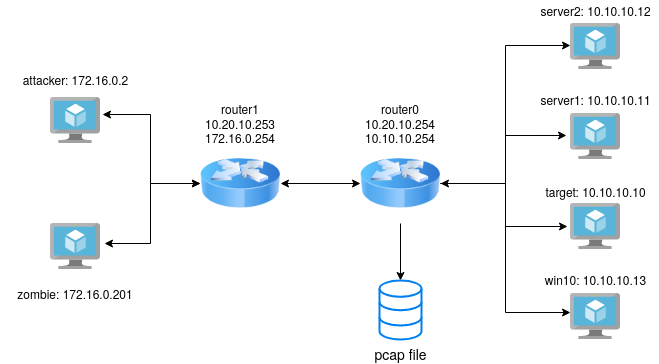

# Testbed for malicious packets generation

This testbed was made and tested on the host configuration
- Ubuntu Linux 18.04.4 LTS
- Vagrant 2.2.7
- Virtualbox 6.1.6

## Using/Reproducing this testbed

```
$ git clone https://github.com/gubertoli/ProbingDataset.git
$ cd ProbingDataset
$ cd testbed
$ vagrant up
```

## Testbed architecture



## Available scripts on /scripts folder

The scripts on this folder are for VM provisioning. All scripts shall be set on the *Vagrantfile*

- *attacker_tcpscan.sh* - Shellscript to perform tcp probing attacks to the target machine
- *nmap_tcpscan.sh* - Shellscript to perform multiples nmap attacks to the target machine
- *win10_gateway.ps1* - Powershell script to perform provisioning for Windows 10 box

## Running the testbed

